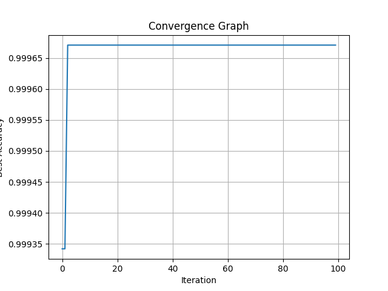

# SVM Optimization 

## Project Description
This project demonstrates optimizing Support Vector Machine (SVM) hyperparameters using a random search strategy. The script uses the Room Occupancy dataset to evaluate different kernel types and regularization parameters to maximize classification accuracy.

## Objectives
1. Load and preprocess the Room Occupancy dataset.
2. Perform random search optimization on SVM hyperparameters.
3. Evaluate SVM models with different kernels and parameters.
4. Save convergence data and accuracy results.
5. Generate a convergence graph to visualize the optimization process.

## Input
The script uses the Room Occupancy dataset (`Room_Occupancy_Data.csv`). The dataset has:

- **Features**: Environmental and room conditions (e.g., temperature, humidity).
- **Target**: Room occupancy count converted to binary classification (0 = unoccupied, 1 = occupied).

### Example structure of the dataset:

| Feature              | Value |
|----------------------|-------|
| Temperature          | 23.18 |
| Humidity             | 27.30 |
| Light                | 500.00 |
| CO2                  | 395.00 |
| HumidityRatio        | 0.003 |
| Room_Occupancy_Count | 1     |

## Output
### Convergence Graph:
The script generates a graph that visualizes the best accuracy achieved across iterations.



### Generated Files:
1. **Convergence Graph (`convergence_graph.png`)**: Visualizes the best accuracy achieved across iterations.
2. **Results CSV (`SVM_Convergence_Data.csv`)**: Contains details of each iteration, including the kernel used, regularization parameter, and best accuracy achieved.

#### Example of `SVM_Convergence_Data.csv`:

| Iteration | Best Accuracy | Best Kernel | Best Nu |
|-----------|---------------|-------------|---------|
| 0         | 0.9333        | linear      | 0.5678  |
| 1         | 0.9444        | rbf         | 0.3456  |
| 2         | 0.9556        | rbf         | 0.4567  |

### Console Output:
- Current working directory.
- Paths for saved files.
- Best accuracy and parameters.

#### Example Output:
```plaintext
Current working directory: /content
Convergence graph saved at: /content/convergence_graph.png
Results saved at: /content/SVM_Convergence_Data.csv
Best Accuracy: 0.9556
Best SVM Parameters: Kernel=rbf, Nu=0.4567
```

## Steps to Run the Project

1. **Clone the repository**:
   ```bash
   git clone https://github.com/bansal9855/Svm_Optimization.git
   ```

2. **Navigate to the project directory**:
   ```bash
   cd Svm_Optimization
   ```

3. **Install required dependencies**:
   ```bash
   pip install pandas matplotlib scikit-learn
   ```

4. **Upload the dataset to Google Colab or your local environment**:
   Ensure `Room_Occupancy_Data.csv` is in the working directory.

5. **Run the script**:
   ```bash
   python svm_optimization.py
   ```

## File Structure
```
SVM_Optimization/
├── svm_optimization.py          # Main script for SVM optimization
├── convergence_graph.png         # Convergence graph (generated after running)
├── SVM_Convergence_Data.csv      # Optimization results (generated after running)
└── README.md                     # Project documentation
```

## Key Learning Outcomes
1. SVM optimization using random search.
2. Visualization of optimization results with Matplotlib.
3. Model performance evaluation using accuracy scores.

## Use Case
This project demonstrates:

- Hyperparameter tuning for machine learning models.
- Application of classification algorithms.
- Visualization and analysis of optimization processes.
